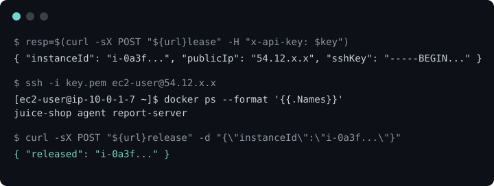

<p align="center"> 
  <a href=".github/workflows/deploy.yml"></a> <a href=".github/workflows/lease.yml"></a>
</p>

**furnace** is an AWS-based Pulumi-self-hosted VM rental service meant to be served on the public internet (unlike [cinders](https://github.com/nadiaenh/cinders/tree/main)).

<p align="center"></p>

## Setup

```sh
git clone git@github.com:nadiaenh/furnace.git
cd furnace
./setup.sh

# Deploy to your AWS account.
export PULUMI_CONFIG_PASSPHRASE=$(cat .pulumi-passphrase)
pulumi up
```

## Usage

```sh
export PULUMI_CONFIG_PASSPHRASE=$(cat .pulumi-passphrase)
url=$(pulumi stack output brokerUrl)
key=$(pulumi config get apiKey)

# Lease an instance.
resp=$(curl -sX POST "${url}lease" -H "x-api-key: ${key}")
# -> { "instanceId": "i-...", "publicIp": "...", "sshKey": "-----BEGIN..." }

# Save the key and SSH in.
key_file=$(mktemp)
echo "$resp" | jq -r .sshKey > "$key_file" && chmod 600 "$key_file"
ssh -i "$key_file" "ec2-user@$(echo "$resp" | jq -r .publicIp)"

# The default workload answers on port 8080.
curl "http://$(echo "$resp" | jq -r .publicIp):8080"

# Release when done.
curl -sX POST "${url}release" -H "x-api-key: ${key}" \
  -d "{\"instanceId\": \"$(echo "$resp" | jq -r .instanceId)\"}"

# Set a different workload to run.
pulumi config set dockerImage <image>
```

## Demo


